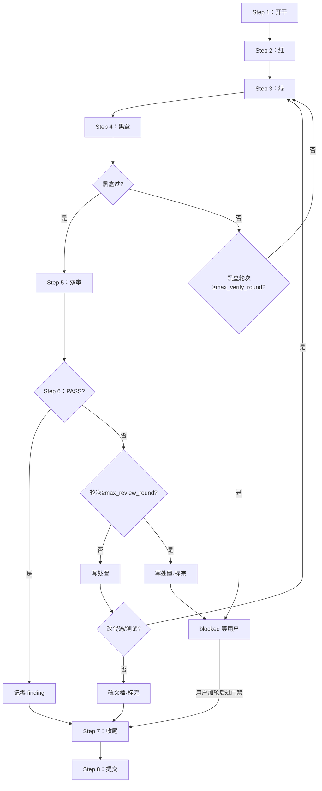

# OmniUsage

常驻桌面进程，把多个 AI 服务商的用量/额度/余额集中读出来、统一展示，如实标注来源与新鲜度。对标 macOS 原生版 UsageBoard，跨 Windows / macOS / Linux。

本文件是 agent 行为入口，包含工作流规则与按需导航。只读取当前任务需要的文档，禁止无目的全量加载。

## 命名（本文件内只在此定义）

- `{tid}`：task 编号，形如 `t001`、`t042`（小写 `t` + 数字）。
- `{sid}`：spike 编号，形如 `s001`、`s003`（小写 `s` + 数字）。
- `{slug}`：小写 `snake_case`。

## 目录与读写规则

| 路径                                                                                          | 用途                                                     | 读取规则                                                                                                                   | 写入规则                                                                                            |
| --------------------------------------------------------------------------------------------- | -------------------------------------------------------- | -------------------------------------------------------------------------------------------------------------------------- | --------------------------------------------------------------------------------------------------- |
| `docs/specs_index.md`                                                                         | 当前生效 spec 清单（在表即生效）                         | 追溯已固化需求时                                                                                                           | task**收尾**时更新；废弃时删除行                                                                    |
| `docs/specs/<slug>.md`                                                                        | 需求级 spec（按已完成 task 累积）                        | 追溯需求实现与验收时                                                                                                       | task**收尾**时累积更新；废弃时移入 `docs/archive/specs/`                                            |
| `docs/tasks_index.json`                                                                       | 活跃 task：tid、状态、branch                             | 接到新需求或状态流转时                                                                                                     | **只能通过 `scripts/task.py` 操作**；禁止直接编辑                                                   |
| `docs/archive/tasks_index.json`                                                               | 归档 task（`done` / `dropped`）                          | 追溯历史 tid 时                                                                                                            | `scripts/task.py finish` / `drop` 自动移入；禁止直接编辑                                            |
| `docs/tasks/{tid}_{slug}/`                                                                    | task 工作区（backlog 起即存在）                          | 执行或审阅 task 时                                                                                                         | 实现侧：`spec.md` `plan.md` `task.md`；reviewer：`review_code.md` `review_test.md`                  |
| `docs/handoff.md`                                                                             | 项目级交接                                               | 接手工作时第一个读                                                                                                         | 只追加                                                                                              |
| `docs/bugs.md`                                                                                | 已知未修复 bug 追加式记录                                | 追溯已知 bug 时                                                                                                            | 发现不立即修复的 bug 追加新条目；修复后在原条目追加「修复」行，不删原条目                           |
| `docs/blueprint/`                                                                             | 当前长期真相：架构、领域、约定、决策                     | 改跨模块行为前读 `architecture.md`；写代码或文档前读 `conventions.md`；新业务概念读 `domain.md`；历史取舍读 `decisions.md` | finalization 时更新；实施与 review 期间仅写入已稳定结论                                             |
| `docs/reviews/review_<TS>/`                                                                   | 独立 review：多模型报告 + adoption 决策                  | 审阅全代码 / diff / 指定范围时                                                                                             | 由 `/multi-model-review` 和 `/multi-model-adoption` skill 生成；本地无独立 review 模板；落地拆 task |
| `docs/spikes/{sid}_{slug}/`                                                                   | 当前 spike                                               | 技术选型或未知风险验证时                                                                                                   | `report.md` 必需；有实验代码再建 `code/`                                                            |
| `docs/templates/`                                                                             | task / spike 等模板                                      | 创建工作项时复制                                                                                                           | 复制使用，不代表 active 数据                                                                        |
| `docs/guides/`                                                                                | 给人看的使用指南（含 `testing.md` 测试命令清单）         | 按需                                                                                                                       | 给人读，不写入 agent 行为规则                                                                       |
| `docs/archive/`                                                                               | 完结或终止的历史                                         | 追溯历史时                                                                                                                 | 镜像原路径；内部文件只准新增                                                                        |
| `src/` `tests/` `scripts/` `assets/` `config/` `connectors/` `schemas/` `vendors/` `patches/` | 源码、测试、脚本、静态源、配置、连接器、契约、依赖、补丁 | 正常开发                                                                                                                   | 正常开发                                                                                            |
| `artifacts/` `data/` `.scratch/`                                                              | 产物、运行数据、一次性草稿                               | —                                                                                                                          | 运行与草稿；临时日志放 `.scratch/`；不入库                                                          |

## 开发原则

- specs driven：先拆 task 并填写 spec/plan（验收标准非空）；后置 task 的 spec/plan 随前置完成修订。
- TDD：可测部分先红后绿。

## 开发工作流

### 总览

- 一个**需求**拆成 N 个 **task**（每个结果独立可验证；过大则继续拆；一个 task 内一个 commit）。
- 每个 task 走一遍「单 task 详细步骤」。

### 命名

- task 目录：`docs/tasks/{tid}_{slug}/`
- task 分支：`{tid}_{slug}`（如 `t001_foo`）
- finding：`{tid}_code_fNNN` / `{tid}_test_fNNN`（NNN 在本 task 内**跨轮累计递增**，不按轮重置）
- 门禁默认上限：
    - `max_verify_round = 5`（黑盒验证轮次上限）；
    - `max_review_round = 2`（双审轮次上限）。
- task 状态：`backlog` / `active` / `blocked` / `done` / `dropped`。

### 新需求拆分与创建 task

1. 跑 `scripts/task.py list` 看现有 task（活跃 + 归档），新 task 从最大 `tid` 加一分配（脚本自动扫主 + archive）；可一次分配多个。
2. 对每个 task：
    - 跑 `scripts/task.py add --title "..." --slug "..."`：脚本分配 `tid`、写 `status: backlog`、`branch` 留空；
    - 创建 task 目录 `docs/tasks/{tid}_{slug}/`（`tid`/`slug` 从脚本输出取）；
    - 从 `docs/templates/task/` 复制并填写 `spec.md`、`plan.md`、`task.md`（front matter：`tid`/`slug`；`diff_anchor` 可占位，**开干**时写实值）。

### 单 task 流程图

下图只示意分支；**以步骤正文为权威**。



### 单 task 详细步骤

- **Step 1：开干**
    - 创建并切换工作分支；跑 `scripts/task.py start <tid>`（状态 → `active`，自动填 `branch` 为 `{tid}_{slug}`），再校验 `git branch --show-current` 与之一致。
    - `task.md` front matter：写入 `diff_anchor`（当前 HEAD SHA）、`branch`（`tid`/`slug` 在 backlog 已填）。
    - `spec.md` 验收标准非空后再进入 **Step 2**。

- **Step 2：红**
    - 可测试部分先写失败测试；运行 `{test_cmd}` 确认失败。

- **Step 3：绿**
    - 实现至测试通过；运行 `{test_cmd}` 确认通过。任务量大可派 sub agent。

- **Step 4：黑盒**
    - 运行 `{blackbox_cmd}`。
    - **通过** → 进入 **Step 5**。
    - **未通过** 且黑盒轮次 **< `max_verify_round`** → 回 **Step 3** 修复后再跑本步。
    - **未通过** 且黑盒轮次 **≥ `max_verify_round`** → **blocked**（见下「blocked」）。

- **Step 5：双审**
    - 跑 `git add -N` 把 untracked 文件以 intent-to-add 形式纳入索引，让 `git diff {diff_anchor}` 能显示其完整内容；随后 `git status` / `git diff --stat` 甄别，把与本 task 无关的文件（编辑器临时文件、IDE 缓存、`.scratch/` 等）用 `git reset <path>` 移出索引，只留本 task 实际产出文件进入审阅（`diff_anchor` 取自 `task.md` front matter）。
    - 渲染 reviewer 提示词：
        ```bash
        scripts/render_review_prompts.py \
          --task-dir docs/tasks/{tid}_{slug} \
          --out-dir .scratch/review_prompts
        ```
    - 派两个 sub agent **并行**执行：一个拿 `.scratch/review_prompts/code_review_prompt.md` 全文作 code reviewer，一个拿 `.scratch/review_prompts/test_review_prompt.md` 全文作 test reviewer。

- **Step 6：处置**（每轮双审结束后执行）
    - **处置表位置（唯一）**：本 task 目录 `task.md` 中的二级标题 **`## Review 处置`**。在其下按轮追加 `### Round N (YYYY-MM-DD HH:MM UTC+8)`，再写 Markdown 表（列：`finding_id | severity | status | rationale | fix_ref`）。格式见 `docs/templates/task/task.md` 同名小节。
    - **`status` 仅三值**：
        - `已修`（本 task 已改完）
        - `遗留`（本 task 解决不了；满轮 blocked 后在「遗留」与口头报告中列出）
        - `撤回`（误报；须原 reviewer 在对应 `review_*.md` 末尾追加撤回记录后才能标撤回）。

    - 跑状态脚本：

        ```bash
        scripts/check_review_status.py --task-dir docs/tasks/{tid}_{slug}
        ```

        读 `code_verdict` / `test_verdict` / `overall` / `round` / `max_review_round`。

    - **`overall=PASS`**：在 `## Review 处置` 下写本轮「零 finding，未进处置表」（或前轮已处置完毕）→ 进入 **Step 7**。
    - **`overall=FAIL` 且 `round < max_review_round`**：在 `## Review 处置` 追加本轮表，逐条填 status（不得留空）。
        - **是（改了代码或测试）** → 回 **Step 3** → **Step 4** → **Step 5** → **Step 6**。
        - **否（未改代码或测试）** → 改必要文档后 **直接收尾**（不再开下一轮双审）。典型：仅文档、全标 `撤回`、或认为无需再实现。`review_*` verdict **不改写**。

    - **`overall=FAIL` 且 `round ≥ max_review_round`**：在 `## Review 处置` 追加本轮表，未修项 status 全部填完 → **blocked**（见下）。

- **Step 7：收尾**
    - 更新 `docs/specs/<slug>.md` 与 `docs/specs_index.md`（本 task 对应累积）。
    - 更新本 task 影响到的 `docs/blueprint/`、`docs/guides/`、`README.md`、API 文档等。
    - 写全 `task.md`「收尾报告」（验收勾选、两轴 verdict、遗留列出）。
    - 跑 `scripts/task.py finish <tid>`：状态 → `done`，自动移入 `docs/archive/tasks_index.json`。
    - 后置 task（非 `done`）受影响则修订其 `spec.md` / `plan.md`。
    - 将 task 目录移入 `docs/archive/tasks/`。

- **Step 8：提交**
    - 本 task 全部改动（含 specs、文档、归档移动）做一个 commit。
    - subject 含 `{tid}`；只在本 task 工作分支上提交。合并进默认分支由外部流程负责。
    - **blocked 未放行前**：不把本 task 当 done 提交；可在分支上保留工作区，不归档。

### blocked

| 触发                                             | 动作                                                                                                                      |
| ------------------------------------------------ | ------------------------------------------------------------------------------------------------------------------------- |
| 黑盒轮次达`max_verify_round` 仍未通过            | 过程记录写明原因与轮次；`scripts/task.py block <tid> --reason blackbox`；`task.md` 过程记录同步说明；口头说明；停自动推进 |
| 双审`overall=FAIL` 且 `round ≥ max_review_round` | 处置表填完；`scripts/task.py block <tid> --reason review`；`task.md` 过程记录同步说明；口头说明；停自动推进               |

进入 blocked 后，agent **必须停下来向用户请求选择**（不得自行决定下一步，不得自动推进）。把下述两个选项呈现给用户并等待显式答复：

- **加轮**：用户批准加轮并指定新上限（新 `max_verify_round` / 新 `max_review_round`）；
    - 跑 `scripts/task.py resume <tid>`（状态 → `active`）；
    - 在 `task.md` 过程记录写新上限；**计数累计不清零**。
    - 黑盒加轮从 **Step 3** 再跑黑盒；双审加轮继续跑 **Step 5** → **Step 6**。
- **dropped**：
    - backlog：`scripts/task.py drop <tid> --reason "..."`（自动移入 archive）；task 目录进 `docs/archive/tasks/`；做一个提交。
    - active / blocked：`task.md`「过程记录」写终止原因；`scripts/task.py drop <tid> --reason "..."`；半成品代码保留在 task 分支（不合并主线）；task 目录移入 `docs/archive/tasks/`；**必须做一个提交**（含 `task.md`、JSON 改动、归档移动、半成品代码），否则切工作区或清理时丢失。

## handoff

- 仅项目级，追加 `docs/handoff.md`。
- 接手先读 `docs/handoff.md`。
- 记录须含 branch 与交出时已有的 head_commit。

## spike

- 选型或未知风险时用；非默认必做。
- 建 `docs/spikes/{sid}_{slug}/`，复制 `docs/templates/spike/report.md`；`sid` 取 spikes 与 archive 中最大编号加一。
- 有实验代码再建 `code/`；可入库，仅作验证材料。
- 结论后移入 `docs/archive/spikes/`。

## 硬约束

- `docs/tasks_index.json` 与 `docs/archive/tasks_index.json` **只能由 `scripts/task.py` 修改**。agent 禁止直接编辑这两个 JSON。脚本失败必须停下提示用户，禁止在未告知用户的情况下手工修 JSON。
- 密钥规则：公网开放的密钥、token、密码、secret 必须由用户提供随机生成值，禁止自设默认值/示例值/弱口令。日常只拿 `hasSecret` 布尔；设置编辑时经 `config:getSecrets` 按实例拉明文回填；用量面板/托盘不拉密钥；日志强制脱敏，开发期同样生效。
- 禁写路径：未经用户允许绝不写 `D:\Kar\Code\omni_usage\` 以外路径（读不受限）。
- WSL 禁 Docker；Docker 服务在宿主机 Win 运行。
- `{test_cmd}`：日常测试命令（单元/集成/E2E/打包 smoke/契约 live 分层）见 `docs/guides/testing.md`，命令多不在此内联；TDD 红/绿循环（Step 2、3）按该指南运行。
- `{blackbox_cmd}`：`pnpm test`（主）；涉及打包须真实启动 `artifacts/win-unpacked/OmniUsage.exe`（`pnpm test:packaged` 打包 smoke）；涉及连接器 live 契约用 `pnpm test:contract:live`。
- 测试规范（命名、层级、回归规则、覆盖率）见 `docs/blueprint/conventions.md` 「编码与测试」小节，不在此重复。

## 文档修改规范

- 结构或语义变化时，先确定最终表述，修改最小完整语义块，禁止逐句打补丁。
- 同一事实、规则或结论只保留一个权威定义；其他位置使用稳定标题或标识引用，避免复制正文和可能失效的编号引用。
- 存在多种合理理解时，先澄清再做跨文档修改。
- 优先使用正向描述；仅安全、不可逆操作、明确禁区三类场景使用否定句。
- 完成后检查：旧表述、重复内容、矛盾结论、失效引用、遗漏同步。
